# 🤖 **HEY, I'M SHEKHAR**

### `BACKEND ENGINEER` • `ANDROID DEVELOPER` • `OPEN SOURCE CONTRIBUTOR`

> **⚡ BUILDING SYSTEMS. SOLVING PROBLEMS. CONTRIBUTING TO OPEN SOURCE.**

I’m a software engineer focused on building **scalable backend systems**, reliable APIs, and modern software products.

I enjoy understanding how systems work under the hood, contributing to **open-source projects**, and continuously improving my engineering skills through real-world development.

---

## 🧠 **CURRENTLY**

```text
[ SYSTEM STATUS : ONLINE ]

> ⚙️ Focusing on Backend Engineering
> 🌐 Building REST APIs & backend systems
> 🐍 Working with Python & FastAPI
> 🔓 Contributing to Open Source
> 🧩 Exploring scalable system design
> 📚 Continuously improving software engineering fundamentals
```

---

## ⚡ **TECH STACK**

### `BACKEND`

`Python` • `FastAPI` • `REST APIs` • `PostgreSQL` • `JWT` • `OAuth2`

### `ANDROID`

`Kotlin` • `Jetpack Compose` • `Android SDK` • `Room` • `Retrofit`

### `TOOLS & ENVIRONMENT`

`Git` • `GitHub` • `Docker` • `Linux`

---

## 🔓 **OPEN SOURCE**

```text
╔══════════════════════════════════════════════════╗
║              OPEN SOURCE MODE : ON              ║
╠══════════════════════════════════════════════════╣
║                                                  ║
║  → Exploring real-world codebases                ║
║  → Solving issues                                ║
║  → Opening Pull Requests                         ║
║  → Reviewing & understanding existing systems    ║
║  → Learning through collaboration                ║
║                                                  ║
╚══════════════════════════════════════════════════╝
```

**Open source isn't just about writing code — it's about understanding existing systems, collaborating with developers, and shipping improvements that others can use.**

---

## 📊 **GITHUB STATS**

<p align="center">
  
  
</p>

---

## 🔥 **CONTRIBUTION ACTIVITY**

<p align="center">


</p>

---

## 🌐 **CONNECT**

<p align="center">

**[ GITHUB ]** • **[ LINKEDIN ]** • **[ EMAIL ]**

</p>

---

```text
╔══════════════════════════════════════════════════╗
║                                                  ║
║   CODE → LEARN → CONTRIBUTE → BUILD → REPEAT   ║
║                                                  ║
╚══════════════════════════════════════════════════╝
```

### `> ALWAYS BUILDING. ALWAYS LEARNING.`
